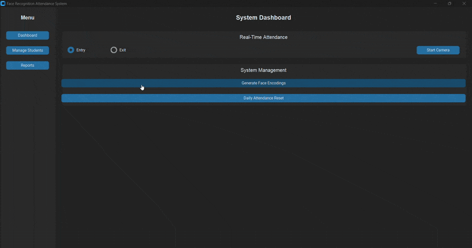

# Face Recognition Attendance System

<p align="center">
  
  
</p>

A complete, end-to-end desktop application built with Python to automate and manage student attendance using real-time facial recognition. The system features a modern GUI for comprehensive student management and detailed daily reporting.

<br>

<p align="center">
  
</p>

---

## ✨ Key Features

-   ✅ **Real-Time Face Recognition:** Marks student entry and exit via a live webcam feed with high accuracy.
-   ✅ **Full Student Management (CRUD):** A complete interface to **C**reate, **R**ead, **U**pdate, and **D**elete student records, including their photos and details.
-   ✅ **Advanced Reporting Dashboard:**
    -   Displays a full daily attendance report, including **absent** students.
    -   **Dynamic Search** by student name or ID.
    -   **Click-to-Sort** functionality on all data columns (ID, Name, Status, etc.).
    -   **Calendar Widget** for easy date selection.
    -   **Export to CSV** functionality for saving and sharing reports.
-   ✅ **Modern & Dynamic UI:** Built with CustomTkinter for a clean, professional, and responsive user interface.
-   ✅ **Robust Backend:** A modular architecture with a centralized database manager for all MySQL interactions.

---

## 🛠️ Tech Stack

| Category            | Technology                                                              |
| ------------------  | ----------------------------------------------------------------------- |
| **Language**        | Python 3.10+                                                            |
| **GUI**             | CustomTkinter, Tkinter `ttk.Treeview`, tkcalendar                       |
| **Computer Vision** | OpenCV                                                                  |
| **Face Recognition**| `face-recognition` (dlib)                                               |
| **Database**        | MySQL                                                                   |

---

## ⚙️ Setup and Installation

Follow these steps to set up the project on your local machine.

### Prerequisites

-   Git
-   Python 3.10 or 3.11
-   MySQL Server

### Installation Steps

1.  **Clone the Repository:**
    ```bash
    git clone [https://github.com/user-aditi/face-attendance-system.git](https://github.com/user-aditi/face-attendance-system.git)
    cd face-attendance-system
    ```

2.  **Create and Activate a Virtual Environment:**
    ```bash
    # Use the Python version you installed (e.g., 3.10 or 3.11)
    py -3.11 -m venv venv
    
    # Activate it (on Windows)
    venv\Scripts\activate
    ```

3.  **Install Dependencies:**
    All required libraries are listed in `requirements.txt`.
    ```bash
    pip install -r requirements.txt
    ```

4.  **Database Setup:**
    -   Ensure your MySQL server is running.
    -   Connect to MySQL and create a new database for the project.
        ```sql
        CREATE DATABASE attendance_db;
        ```

---

## 🔧 Configuration

The application requires a configuration file with your database credentials.

1.  Find the `config.ini.template` file in the main directory.
2.  Create a copy of this file and rename it to **`config.ini`**.
3.  Open `config.ini` and fill in your MySQL `host`, `user`, `password`, and `database` details. The application will not run without this file.

---

## ▶️ How to Use the System

1.  **Run the Application:**
    ```bash
    python app.py
    ```
2.  **Add Students:**
    -   Navigate to the **"Manage Students"** tab.
    -   Use the "Add New Student" button to populate the system. You can also **Edit** or **Delete** existing students from this panel.

3.  **Generate Encodings:**
    -   After adding/updating student photos, go to the **"Dashboard"**.
    -   Click **"Generate Face Encodings"**. This is a crucial step that must be done anytime student photos are changed.

4.  **Take Attendance:**
    -   From the **"Dashboard"**, select "Entry" or "Exit" mode.
    -   Click **"Start Camera"** to begin the real-time recognition process.

5.  **View Reports:**
    -   Navigate to the **"Reports"** tab to view the daily attendance log. Use the filters and click on column headers to sort the data.

---

## 📄 License

This project is licensed under the MIT License.